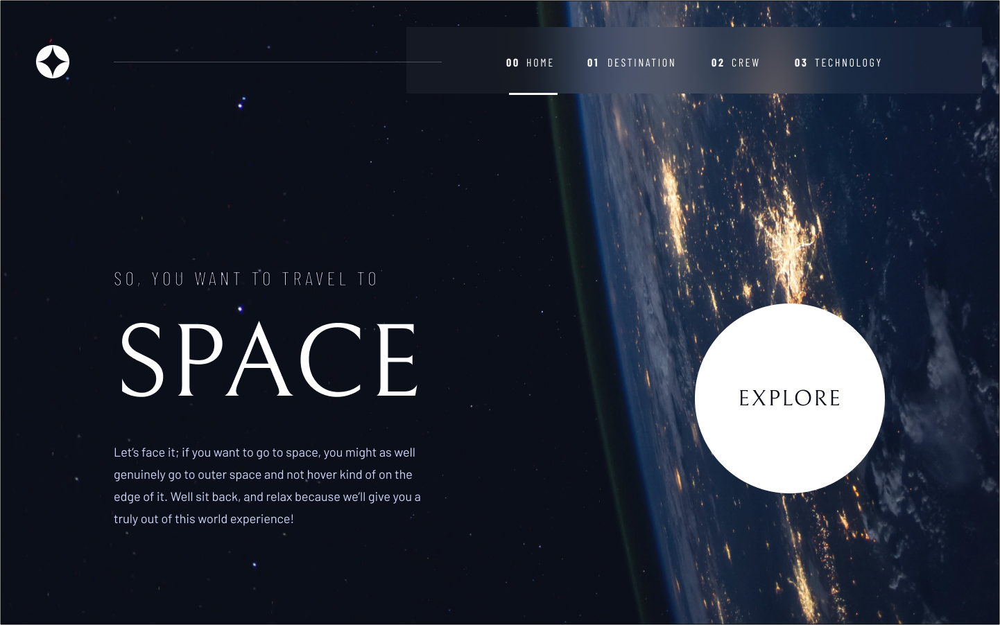

# 🚀 Space Tourism Multi-Page Website 
Este é um projeto de website multi-páginas para turismo espacial, desenvolvido como parte de um desafio do **Frontend Mentor**. O objetivo é fornecer uma experiência de usuário imersiva e responsiva sobre destinos, tripulação e tecnologias espaciais.

## 🎯 Visão Geral 
O site apresenta várias páginas conectadas que mostram informações detalhadas sobre viagens espaciais, com dados de uma base JSON fictícia. As páginas são:
- **Home**: Visão geral do turismo espacial.
- **Destination**: Exploração dos principais destinos espaciais.
- **Crew**: Informações sobre a tripulação.
- **Technology**: Detalhes sobre as tecnologias espaciais.

## 🛠️ Tecnologias Utilizadas

- **React**: 
- ****: Biblioteca principal para construção da interface de usuário.
- **React Router**: Para navegação entre as diferentes páginas.
- ****: Para tipagem estática e melhoria do fluxo de desenvolvimento.
- **TypeScript**: 
- **Tailwind CSS**: Para estilização e design responsivo.
- **Vite**: Ferramenta de build rápida e eficiente para desenvolvimento.
- **JSON**: Base de dados para as informações de destinos, tripulação e tecnologias.

## 🔧 Configuração e Execução
**Pré-requisitos**
- Node.js instalado na sua máquina.
### Passos para executar o projeto
1. **Clone o repositório:**:

```bash
git clone https://github.com/tatyanepgoncalves/Space-app.git
```

2. **Instale as dependências**

```bash
cd space-tourism-multi-page
npm install
```

3. **Inicie o servidor de desenvolvimento**

```bash
npm run dev
```
4. Abra seu navegador e acesse `http://localhost:300` para visualizar o projeto.

## 📂 Estrutura de Pastas

```bash
├── public
│   │── favicon.png  
│   └── preview.jpg          
├── src
│   ├── images              
│   ├── components           
│   ├── data                 
│   ├── router               
│   ├── App.tsx             
│   ├── index.css             
│   ├── main.tsx             
│   └── vite-env-e.ts             
├── .gitignore
├── eslint.config.js
├── index.html
├── package.json
├── package-lock.json
├── README.md
├── tailwind.config.js
├── tsconfig.json
├── tsconfig.app.json
├── tsconfig.node.json
└── vite.config.ts           
```

## 🚀 Desafios Encontrados
- Implementação do layout de design responsivo com Tailwind.
- Navegação eficiente entre páginas com React Router.
- Validação de dados e tipagem em TypeScript.

## 💡 Melhorias Futuras
- Adicionar animações para transições mais suaves.
- Implementar uma API real para buscar dados dinâmicos.
- Melhorar a performance do carregamento de imagens.